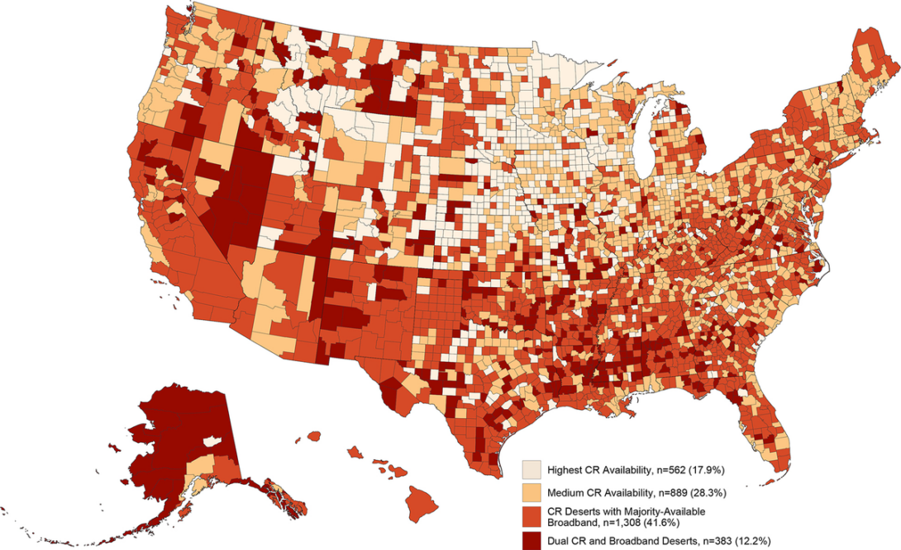

Around 800,000 people in the United States have a heart attack every year. Cardiac rehabilitation (CR) helps people recover from and prevent heart attacks, heart failure, and other cardiac conditions. However, a recent [study](https://journals.lww.com/jcrjournal/abstract/2024/07000/county_level_cardiac_rehabilitation_and_broadband.3.aspx) highlighted with this MapLog found that nearly half of U.S. adults live in counties where access to CR is limited. Hybrid CR programs, which deliver sessions both in person and remotely online, have the potential to increase access to CR by removing some barriers to in-person participation – including long travel distances, lack of transportation, discomfort exercising with other patients, and inconvenient program hours.

While CR programs with a telehealth component can help address geographic disparities in CR participation, access is tied to the availability of broadband service in a patient’s area. To better understand the landscape of CR and broadband availability across the country, CDC created a county-level map of the intersection of CR availability and broadband access in the United States.

### Mapping CR Availability and Broadband Access

::: {style="float: right; width: 50%; margin-left: 15px;"}

:::

Geographic Patterns of County-Level Cardiac Rehabilitation (CR) Availability and Broadband Access
Using data from the Centers for Medicare & Medicaid Services (CMS), the U.S. Bureau of the Census, and the Federal Communications Commission’s Broadband Deployment Report, CDC mapped county-level CR availability and broadband access in the United States.

CR availability for each county was categorized as lowest, medium, or highest percentage of CR demand met. Nearly half of U.S. adults live in the lowest category: CR deserts where only 35% of CR demand is met. CDC then classified the level of broadband availability in CR deserts to identify counties with majority-available broadband (≥50%), as well as dual CR and broadband deserts. Among people living in CR deserts, nearly everyone (96.8%) lives in the three-quarters (77.4%) of CR desert counties where broadband is available to the majority of residents.

### Expanding Hybrid CR Services

The CR/broadband map – created as part of the study “[County-Level Cardiac Rehabilitation and Broadband Availability Opportunities for Hybrid Care in the United States](https://journals.lww.com/jcrjournal/abstract/2024/07000/county_level_cardiac_rehabilitation_and_broadband.3.aspx)” – illustrates how implementation of hybrid programs could expand CR availability to as many as 113 million U.S. adults. The map also helps identify and prioritize regions that have the greatest need for hybrid CR and might benefit from programs like the [Digital Equity Act’s Competitive Grant Program](https://www.ntia.gov/program/digital-equity-act-programs/digital-equity-competitive-grant-program), which supports projects that help people access high-speed internet, regardless of where they live.

This type of data visualization helps decision makers see more clearly how policy changes – like those allowing for virtual supervision and remote delivery of CR from an outpatient hospital setting – can substantially increase the number of people able to access CR following a heart attack or other CR-qualifying event, procedure, or diagnosis each year.

For more details, read the [article](https://doi.org/10.1097/hcr.0000000000000865) published in the Journal of Cardiopulmonary Rehabilitation and Prevention.

--- 

Resources

- [The Next Generation: Hybrid Cardiac Rehabilitation](https://vimeo.com/988916303) (Video)
- [Cardiac Rehabilitation Change Package, Second Edition](https://millionhearts.hhs.gov/files/Cardiac_Rehab_Change_Pkg.pdf)
