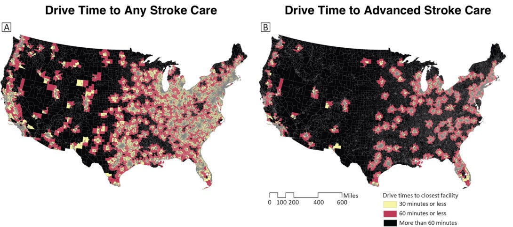

Minimizing the time from stroke onset to treatment is critical for improving stroke outcomes. Therefore, timely geographic access (i.e., less than 60 minutes) to certified stroke care is important. This MapLog highlights a recent nationwide study that found that rural and high-risk communities disproportionately lack timely access to certified stroke care.

To clearly visualize geographic patterns in timely access to certified stroke care across the country, researchers at CDC and the University of Illinois Chicago conducted a cross-sectional spatial analysis. They mapped drive times to any certified stroke care facility (Map A) and to advanced stroke care facilities (Map B), using population-weighted centroids for each census tract. Then, they compared community characteristics and prevalence of stroke risk factors between census tracts with and without timely access to certified stroke care (i.e., < 60 minutes). This is the first study of stroke care proximity to examine differences in prevalence of multiple stroke risk factors such as high blood pressure, obesity, and diabetes.

### Geographic Disparities in Timely Access to Certified Stroke Care
Map A demonstrates geographic disparities in timely access to any type of certified stroke care facility. People living in parts of the Southwest, Mountain Region, Northern Plains, and Deep South lack timely access to any type of certified stroke care facility. However, most people living in the eastern half of the country live within a 30- or 60-minute drive to a certified stroke care facility.

Map B shows even larger geographic disparities in timely access to advanced stroke care facilities (i.e., comprehensive and endovascular-capable facilities). Nearly 50 million people live in large swaths of census tracts in the South, the West, and rural areas across the country that are lacking timely access to advanced stroke care. Census tracts that do have timely access to advanced stroke care are scattered primarily within the eastern portions of the United States and along the Pacific Coast.

### Rural and High-Risk Communities Disproportionately Lack Timely Access to Stroke Care
The researchers found that rural communities accounted for 91% of census tracts lacking timely access to any certified stroke care facility and 65% of census tracts without timely access to advanced stroke care facilities. Furthermore, census tracts without timely access to stroke care had significantly higher prevalence of stroke risk factors (including high blood pressure, coronary heart disease, high cholesterol, diabetes, chronic kidney disease, fair or poor self-rated health status, smoking, and obesity) and fewer socioeconomic resources.

### Improving Stroke Systems of Care

The finding that nearly 50 million people disproportionately located in rural and high-risk communities lack timely access to stroke care spotlights the need for continued improvement in stroke systems of care. These maps highlight the communities that would benefit most from improvements such as a) increasing awareness of stroke signs and symptoms, b) expanding telestroke care and regional stroke transport programs, and c) increasing the identification and treatment of stroke risk factors. See the full study: Disparities in Timely Access to Certified Stroke Care Among US Census Tracts, by Prevalence of Health Risk Factors
