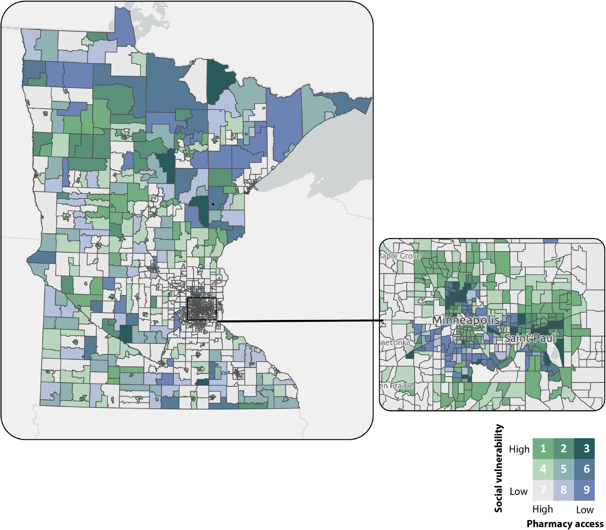
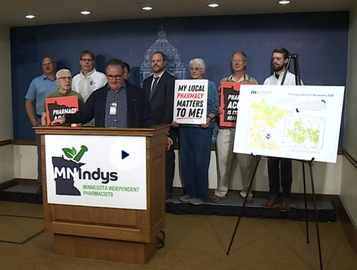

Across public health research studies, definitions of a “pharmacy desert” can vary, making it difficult to fully understand the barriers to pharmacy access in each state. In Minnesota – where 13% of community pharmacies were lost from 2009 to 2024 – the Minnesota Department of Health developed a tailored approach to mapping pharmacy access (proximity) based upon metropolitan status and distance threshold. Using this more precise description, the map contributes to a more accurate and actionable understanding of the barriers to pharmacy access across the state.

### Making a Customized Map of Pharmacy Access

To begin, the Minnesota Department of Health (MDH) used ArcGIS Pro 3.3.0 (Esri) to geocode pharmacies identified by the Minnesota Board of Pharmacy, and Network Analyst to measure driving distance between the population center of each census tract and the closest two pharmacies.

MDH then customized the definition of pharmacy access in Minnesota based on a combination of metropolitan status and distance. Census tracts were categorized as urban core, metropolitan, or non-metropolitan, and distance thresholds were defined for each category as urban core  (1 mile), metropolitan (5 miles), and nonmetropolitan (15 miles).

Finally, pharmacy access was defined as low access if there were no pharmacies within the designated threshold, limited access if there was only 1 pharmacy within the designated threshold, and high access if there were 2 or more pharmacies within the designated threshold.

Census tracts were also categorized according to the 2022 Social Vulnerability Index (SVI).  SVI scores range from 0 to 1. High vulnerability was defined as a score of 0.75 or higher, moderate vulnerability as 0.5 to less than 0.75, and low vulnerability as 0 to less than 0.5.

{width="50%" fig-align="center" style="margin-top: 20px"}

### Highlighting Areas of Minnesota with Low Pharmacy Access and Vulnerable Populations

Using a definition of pharmacy access that incorporates metropolitan status and distance thresholds customized for Minnesota, MDH found that, of the 1,498 populated census tracts in Minnesota, 147 had low pharmacy access and 207 had limited pharmacy access, representing 1,130,177 people in Minnesota, or 19.9% of the total population. From 2009 to 2024, twenty-four tracts with 77,000 residents became low-access tracts because of pharmacy closures. These tracts were more vulnerable than low-access tracts that existed as of 2009.

The map makes it clear that census tracts with the lowest levels of pharmacy access and highest levels of vulnerability can be found in both rural and urban areas. By including the category of limited access, the map also highlights the large number of census tracts in which – with only one pharmacy – the closure of that pharmacy would dramatically impact the local population.

### Monitoring and Advancing Pharmacy Access

::: {style="float: right; width: 30%; margin-left: 15px;"}

:::

Local pharmacies represent a critical source of evidence-based guidance and clinical services to support medication adherence, help patients manage chronic conditions and avoid hospitalizations. In Minnesota, where low reimbursement rates have helped fuel the increase in pharmacy closures, the map was used [to support pharmacy policy initiatives included in an omnibus health law](https://www.kare11.com/article/news/local/independent-pharmacists-plead-case-at-minnesota-state-capitol-mass-closures/89-53a3d92f-6856-4d71-8613-5d82dc488dff) enacted by the state legislature. The law establishes a single state-run pharmacy benefit manager to manage prescription drug benefits for Medicaid patients with the aim of improving pharmacy access and controlling costs. The legislation also increases dispensing fees for pharmacies serving underserved populations to offset administrative costs and support pharmacy operations.

As community pharmacies continue to serve as critical connection points between patients and basic health services, Minnesotans will benefit from policy changes that address areas of low pharmacy access and help maintain access where it is limited. The map is helping to shed light on the barriers to pharmacy access across the state and will serve as a key resource for monitoring pharmacy access and informing public health decisions.

For more details, read the [article](https://www.cdc.gov/pcd/issues/2026/25_0451.htm) published in Preventing Chronic Disease.

 


