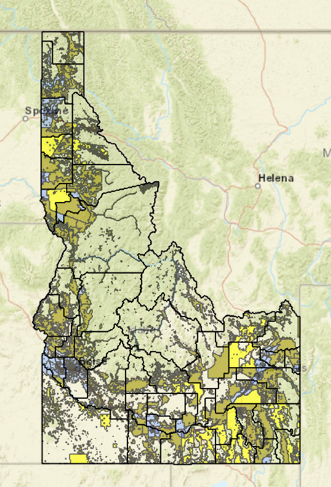

::: {style="float: right; width: 27%; margin-left: 15px;"}

:::

Despite rapid population growth in Idaho over the last few decades, the idea persists that Idaho is primarily a “rural state.”  This perception has been sustained, in part, by maps of Idaho that paint a picture of a state dominated by vast, empty spaces. What traditional maps have not made clear is that many of the rural areas in Idaho are primarily non-habitable federal lands.  In fact, about 60% of Idaho’s land area is federally owned, and only about 35% of the state’s population lives in rural areas. To more effectively and efficiently serve the health needs of those rural populations, Robert Graff of the Idaho Department of Health and Welfare (IDHW) created the *Livable Idaho Map*, which focuses attention on the rural parts of the state where residents actually live.

### Map displays population density adjusted for where people live

The interactive *Livable Idaho Map* accounts for public lands or other undeveloped areas, thereby offering a more nuanced view of the population density of the state.  To create the map, Robert removed public lands (Bureau of Land Management, US Forest Service, and state-managed lands) and used the remaining available area to calculate *livable area population density*.  He mapped four categories of livable area population density, with yellow areas having the lowest livable area population density (2 – 6.5 persons per square mile), and dark blue areas having the highest livable area population density (250.01 – 20926.7).  The percentage of the Idaho population that lives in each category is included in the map key.  Popups for each census tract provide additional details and allow map viewers to compare livable area population density to the standard measure of population density.  A thin band of census tracts with high measures of livable area population density is observed from east to west along the southern part of the state (following both a river system and an interstate highway).  The zoom feature and four inset maps make it easier to identify detailed patterns of the livable area population density.

### Map sparks a change in mindset

The Idaho Department of Health and Welfare has shared this distinctive visualization of Idaho’s rural population with the Bureau of Healthcare Access, inspiring a shift in mindset regarding the geographic scope of rural health issues — from an “every corner of the state” problem to one far more geographically manageable –and focused on providing health services to the more populated rural areas.  Staff are using the map to identify where taking actions like locating healthcare facilities and expanding access to telehealth services (specifically broadband capability) would have the greatest impact. In addition, when using the livable area map to examine geographic patterns of health outcomes, such as cardiovascular disease prevalence, the counties of non-livable areas no longer dominate the map and the patterns for cardiovascular disease in Idaho are much clearer.  Robert notes that the unique value of the map is how effectively it supports the pivot from “most of Idaho is rural” to the more precise and actionable message: “Roughly 35% of Idahoans live in rural areas, and they deserve access to high quality care.”

If you have questions about the methods used to calculate the livable area population density or development of the Livable Idaho map, contact Robert Graff at [Robert.Graff@dhw.idaho.gov](mailto:Robert.Graff@dhw.idaho.gov).

 



