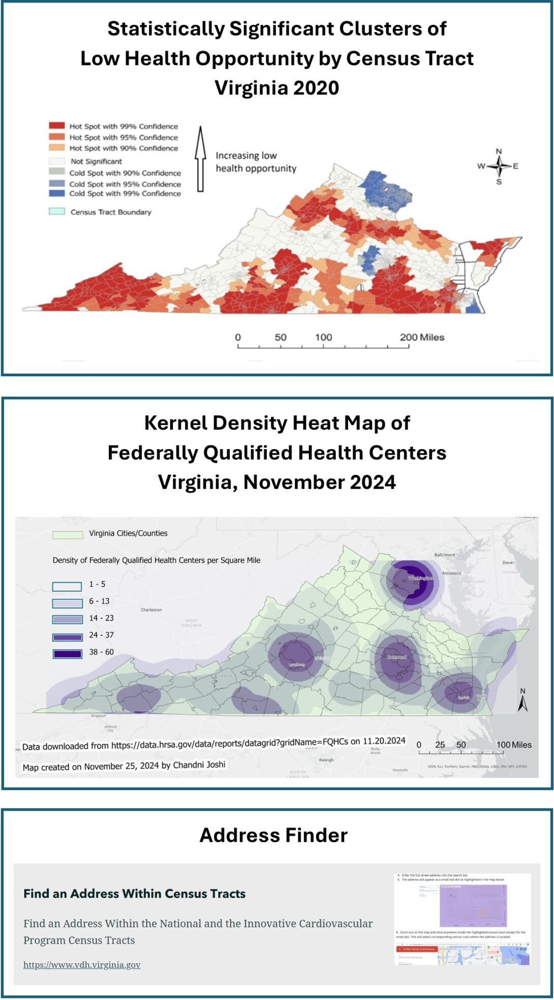

::: {style="float: right; width: 40%; margin-left: 15px;"}

:::

Cardiovascular disease is the leading cause of death in the United States and a significant public health challenge in communities across the country. In Virginia, the [Healthy Hearts Initiative (HHI)](https://www.vdh.virginia.gov/heart-disease/virginia-healthy-hearts-initiative/), funded by CDC, focuses on preventing and managing cardiovascular disease in the state’s high-risk populations. One of their unique and innovative approaches, led by senior epidemiologist Chandni Joshi, is the creation of a StoryMap – a decision-support tool that centralizes data, highlights geographic health disparities, and provides actionable insights to guide program planning, implementation, and evaluation.

### Mapping Virginians’ Health

Drawing from a range of datasets and sources – [CDC PLACES](https://www.cdc.gov/places/index.html), the [Virginia Health Opportunity Index](https://www.vdh.virginia.gov/health-equity/virginia-health-opportunity-index/), the [American Community Survey](https://www.census.gov/programs-surveys/acs/), [Health Research and Services Administration (HRSA)](https://www.hrsa.gov/), and the [Virginia Department of Emergency Management](https://www.vaemergency.gov/) – Virginia’s StoryMap is a robust and data-rich tool featuring:

- Hotspot cluster maps showing high-need census tracts (e.g., Map 1a),
- Travel-time analysis maps showing drive times to health center​s,
- Linkage maps showing the nearest health centers to census tracts (e.g., Map 1b), and
- Multivariate maps highlighting areas with both high hypertension prevalence and limited access to care.​

In addition, the StoryMap’s census tract profiles describe areas of high socioeconomic and disease burden, and the geocoding tool enables local partners to focus outreach efforts and tailor services.

### Driving Focused Action

As a comprehensive data visualization tool, Virginia’s StoryMap has enabled HHI to better understand the landscape of CVD risk factors and access to care across the state. Staff have used the multivariate analyses maps, for example, to identify census tracts with both above-average hypertension and long travel times to federally qualified health centers, helping to focus resources on priority needs.

Likewise, using the hotspot analyses, staff identified census tracts with both high hypertension prevalence and low health opportunity scores, leading to the hiring of three regional cardiovascular health coordinators focused on those areas of the state.​

Virginia’s partners are also taking advantage of the unique resource in many ways, including using the StoryMap’s geocoding tool to identify patients living in priority census tracts to inform local-level planning and the interactive census tract profile map to support program planning and implementation. Chandi describes the StoryMap as a “living document,” and is working on developing more maps, such as a map of food desert, to add to the tool.

Enhancing the Tool
HHI has shared the tool internally with VDH staff and Healthy Hearts Initiative partners—as well as externally with technical assistance partners—and have used their feedback to enhance the site. Looking ahead, HHI plans to continue expanding the platform by, for example, adding new analyses like drive-time estimates to hospitals.​

 



