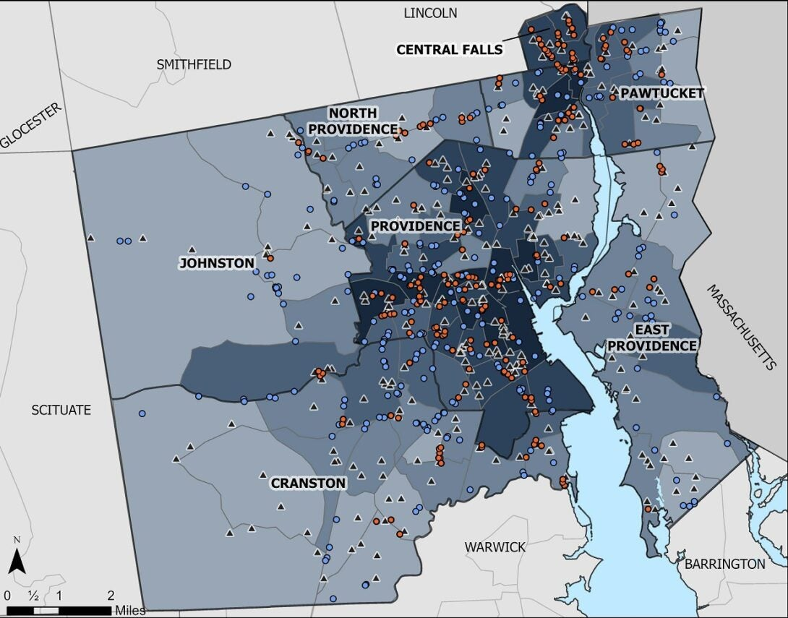

::: {style="float: right; width: 50%; margin-left: 15px;"}

:::

While overall U.S. tobacco use declined in the last decade, e-cigarettes, offered in a variety of kid-friendly flavors, grew in popularity. In December 2018, the [Surgeon General](https://www.cdc.gov/tobacco/basic_information/e-cigarettes/surgeon-general-advisory/index.html) declared an epidemic of youth e-cigarette use. Rhode Island was no exception, with nearly half of all high school students having ever used an e-cigarette product. The Rhode Island Department of Health Tobacco Control Program (RITCP) used maps to visualize key tobacco industry tactics for targeting youth, drawing on skills gained from the [GIS Capacity Building Program](https://www.cdc.gov/dhdsp/programs/gis_training/).

### Visualizing the Tobacco Industry Influence Near Schools

Youth, especially those in low-income communities, are a target audience for Big Tobacco. Through strategies such as tobacco retail point-of-sale (POS) advertising, the tobacco industry exerts its influence by meeting youth where they live, learn, and play. [Approximately 70% of teenagers](https://www.ncbi.nlm.nih.gov/books/NBK99237/) shop at convenience stores at least once per week. Youth exposed to tobacco POS advertising are [more likely to start](https://pubmed.ncbi.nlm.nih.gov/17485618/) using tobacco products. Furthermore, rates of tobacco use are higher when there are more tobacco retailers in walking distance of schools.

To illustrate the influence of the tobacco industry on youth in Providence and surrounding areas, RITCP mapped the locations of tobacco and e-cigarette retailers (including vape stores) relative to K-12 schools, and flagged those that were within 1,000 feet of K-12 schools. For the [core cities](https://health.ri.gov/publications/guidelines/CoreCityData.pdf) with 15% or more of children living below the poverty threshold, over 40% of all tobacco retailers were within walking distance to a school. In Central Falls, every tobacco retailer was within walking distance of a school.

### Mobilizing Community and State Leadership for Change

The map above was used to support policy change, educate tobacco control stakeholders, and promote multisector partnerships. During the outbreak of [E-Cigarette and Vaping-Associated Lung Injury (EVALI)](https://www.cdc.gov/tobacco/basic_information/e-cigarettes/severe-lung-disease.html), Rhode Island Tobacco Control and partners included the map as a resource to support and provide context for the state policy that ultimately led to [prohibiting the sale of flavored Electronic Nicotine Delivery Systems (ENDS)](https://rules.sos.ri.gov/regulations/part/216-50-15-6). This map has also been used statewide in a series of tobacco control trainings in health equity to educate stakeholders on the problem. Furthermore, community leaders have been inspired to develop their own versions of this map. For example, partners in Central Falls, including the City of Central Falls Planning Department, collaborated to create an enhanced map that identifies tobacco retailers not only near schools, but also near athletic fields and parks, with the goal of aligning cross-sector partnership priorities related to youth substance use prevention. Community-level maps like the ones inspired by RITCP’s work can help make the case for enhanced local-level data collection. This is especially beneficial for localities to make policy decisions that are equitable and meet the unique needs of community members. To get started with tobacco control mapping efforts for your state or community, check out [CDC’s guide](https://www.cdc.gov/tobacco/stateandcommunity/guides/pdfs/best-practices-mapping-techniques.pdf).
