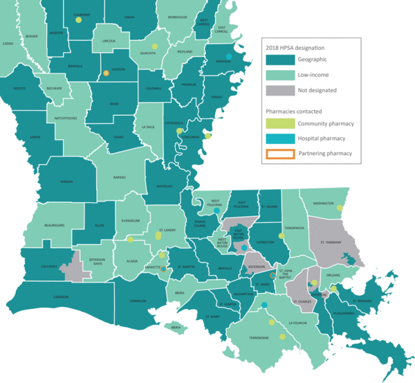

::: {style="float: right; width: 50%; margin-left: 15px;"}

:::

### Pharmacists Can Play a Critical Role in Improving Medication Adherence

Improving medication adherence is a funding priority for state efforts to fight chronic disease – as noted in CDC’s [1815](https://www.cdc.gov/diabetes/programs/stateandlocal/funded-programs/dp18-1815.html) and [1817](https://www.cdc.gov/diabetes/programs/stateandlocal/funded-programs/dp18-1817.html) grants – because it plays a critical role in preventing and managing diabetes, heart disease and stroke. Proven strategies for increased medication adherence include enabling pharmacists to practice at their full license capacity, expanding their role in chronic disease management beyond simply dispensing medications and into active participation in team-based care. [Collaborative drug therapy management (CDTM)](https://www.cdc.gov/dhdsp/pubs/docs/Translational_Tools_Pharmacists.pdf) agreements allow pharmacists – without the direct approval of a physician – to initiate, modify, or discontinue drug therapy and provide ongoing support of patients’ control of chronic conditions, including high-blood pressure and diabetes.

Despite substantial evidence indicating that adherence to prescribed medications improves chronic disease outcomes and decreases the risk of dying, medication nonadherence is widespread in the United States, leading to poor health outcomes and higher costs of care.

### Legal Barriers Create Roadblocks, Especially in Rural Communities

CDTM is particularly beneficial for increasing access to care in rural and health provider shortage areas (HPSAs), where access to pharmacists is very often greater than access to physicians. However, in some states, legal restrictions have prohibited small, rural pharmacies from establishing these types of agreements. In Louisiana, state policies limit the types of conditions a pharmacist can treat, permit collaboration only between a pharmacist and physician (excluding, for example, nurse practioners), oblige the participating physician to be “physically present daily” to enter into an agreement, and require burdensome paperwork.

### Map Demonstrates Opportunity for Impact

In 2018, [Well-Ahead Louisiana](https://wellaheadla.com/), a chronic disease prevention and health care access initiative of the Louisiana Department of Health, launched an initiative to increase the use of CDTM in the treatment of heart disease and diabetes across the state. A key step in the process was to create a map of HPSAs, as well as some of the pharmacies interested in entering into a CDTM agreement. Health department staff employed skills learned through the [GIS Capacity Building Program](https://www.cdc.gov/dhdsp/programs/gis_training/) – hosted by CDC’s [Division for Heart Disease and Stroke Prevention (DHDSP)](https://www.cdc.gov/dhdsp/), the University of Notre Dame, and the National Association of Chronic Disease Directors (NACDD) – to create the map.

With its vibrant colors and unique perspective, Louisiana’s map clearly illustrates that virtually every parish in the state has been designated a geographic or low-income HPSA. Well Ahead Louisiana used the map to effectively call out the need for increasing the access of millions of patients to pharmacists, who can more closely monitor their condition and make changes when needed. The map helps to show that, operating at their full license potential, pharmacists could make significant improvements in medication adherence among their patients, even in resource limited settings.

### Partnerships Facilitate Change

Well-Ahead Louisiana shared their map with partners – including pharmacies, pharmacy organizations, and health systems – to communicate the problem and offer solutions. Working together, the coalition drafted new CDTM legislation enabling pharmacists to work at their full license capacity and presented it to state lawmakers. With the benefit of GIS tools and maps, Well Ahead Louisiana and their partners are making progress toward modifying CDTM regulations and ensuring pharmacists in rural Louisiana can meaningfully contribute to lower rates of chronic disease in rural areas across the state.

Click [here](https://www.cdc.gov/pcd/issues/2020/20_0051.htm) to read the full story.
