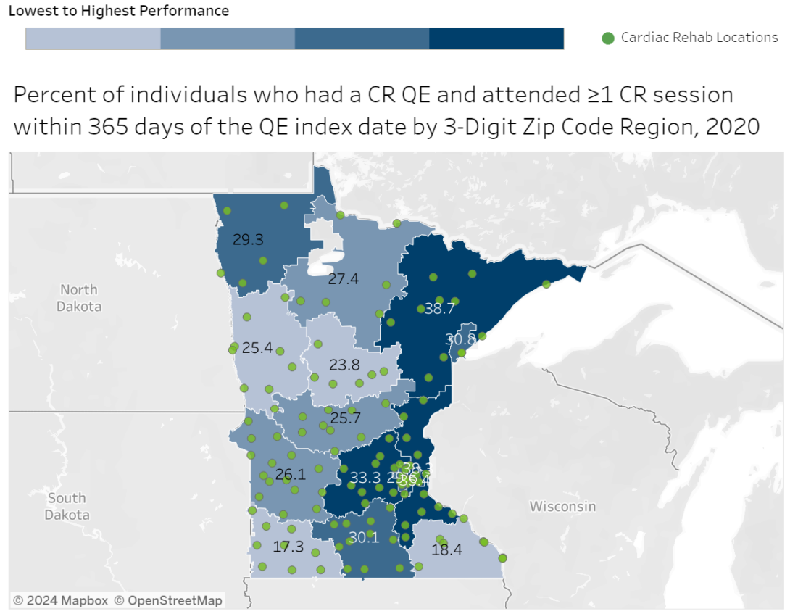

::: {style="float: right; width: 50%; margin-left: 15px;"}

:::

In Minnesota, heart disease is the second leading cause of death, after cancer. Minnesotans experienced more than 43,000 acute heart disease hospitalizations in 2020, and in 2021, over 165,000 Minnesotans reported having had a heart attack at some time in their lives. Cardiac rehabilitation (CR) is an evidence-based secondary prevention program designed to improve cardiovascular health following a cardiac event like a heart attack or a cardiac procedure, such as receiving a stent or having heart bypass or transplant surgery. Benefits of CR participation include a 13% to 24% reduction in total mortality over one to three years, a 31% decrease in rehospitalizations over one year, and an increase in physical function and quality of life.[^1]

Despite considerable evidence of its effectiveness, CR is widely underused; participation rates range from 19% to 34% in national analyses with substantial geographic by state and differences by cardiac diagnosis.1 The Minnesota Department of Health (MDH) is working to increase rates of CR use by eligible individuals in the state, in line with [CDC’s Million Hearts Initiative](https://millionhearts.hhs.gov/about-million-hearts/optimizing-care/cardiac-rehabilitation.html) goal of 70% CR participation.

### Using Data in New and Better Ways

To inform strategies intended to bridge the divide between participating and nonparticipating CR-eligible patients, MDH analyzed CR rates among all payers in the state – including publicly and privately insured patients. Previously, estimates were limited to Medicare fee-for-service data; as a result, analyses of CR rates among working age adults had not been available. With funding from CDC’s Division for Heart Disease and Stroke Prevention (DHDSP) and guidance from the Million Hearts initiative, Minnesota used all-payer claims data to conduct the first statewide, population-based assessment of the initiation of, participation in, and completion of outpatient CR. Because approximately half of CR patients in Minnesota are not Medicare enrollees, these data are more representative of the state’s population.

### CR Dashboard Makes Data Clear

Using data from the Minnesota All Payer Claims Database, MDH staff created maps that offer a clear picture of the geographic disparities in CR use. To ensure the data are widely available, the Minnesota Association of Cardiovascular and Pulmonary Rehabilitation encouraged MDH to share the maps online. As a result, the MDH team launched the new [Cardiac Rehabilitation Use in Minnesota Dashboard](https://www.health.state.mn.us/diseases/chronic/cardiacrehabdata.html) in April 2024. This interactive dashboard features charts and maps of CR enrollment, initiation, participation, and completion rates for 15 regions. The maps make it easy to identify the location of CR centers and then zoom in on a number of metrics, such as the percentage of people who enrolled in CR within 21 days of their qualifying event (e.g., heart attack), the average number of CR sessions attended within 36 weeks, and the percentage of enrollees who attended all 36 CR sessions.

### Maps Strengthen Partners’ Work

One of MDH’s key partners, M Health Fairview, has used the CR maps to develop shared goals for improving CR delivery in Minnesota among public health professionals, CR services, and program delivery sites. Notable geographic variations in patterns of CR initiation, participation, and completion led staff to survey health care staff in low CR use regions to identify potential barriers. Insights from these efforts revealed a variety of barriers including issues with internal and external communication and procedures. From these findings, the team developed a comprehensive intervention plan to address the barriers. The intervention includes translating inpatient education resources into other languages, adding CR referral information to the cardiology onboarding process, establishing an inpatient rehabilitation collaboration, and updating the discharge-to-home order set. To address cost barriers, M Health Fairview has also begun covering some of the cost of parking for multiple CR sessions at key locations.

For more details, read the [article](https://www.cdc.gov/pcd/issues/2023/22_0324.htm) published in Preventing Chronic Disease.

[^1]: [Increasing Cardiac Rehabilitation Participation From 20% to 70%: A Road Map From the Million Hearts Cardiac Rehabilitation Collaborative – ScienceDirect](https://www.sciencedirect.com/science/article/pii/S0025619616306486?via%3Dihub)
