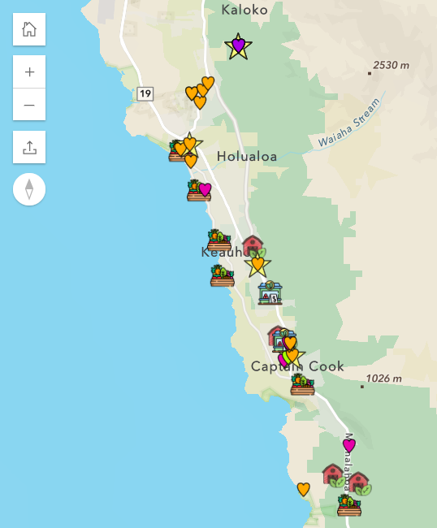

Ono is a Hawaiian word often used to describe something delicious — food that is tasty, satisfying, and makes you crave more. The name Ono for Hawai‘i reflects the goal of nurturing in keiki (children) an ono for the local, traditional canoe-crop foods that Hawaiians have cherished since childhood. Despite the deep cultural and agricultural significance of these foods, an estimated 85%–90% of Hawai‘i’s food supply is currently imported.

To help ensure that keiki in preschools and other early childhood education (ECE) programs across Hawai‘i have access to traditional foods grown by local farms, the Hawai‘i State Department of Health, Chronic Disease Prevention and Health Promotion Division (CDPHPD), developed the [Ono for Hawai‘i map](https://health.hawaii.gov/physical-activity-nutrition/home/early-childcare-education/).

### How Farmers and Keiki Find Each Other

::: {style="float: right; width: 27%; margin-left: 15px;"}

:::

The purpose of the map is to form pilina (relationships); CDPHPD wants to encourage relationship building between local producers (farms, farmers markets, food hubs) and ECE sites.

For farmers, the Ono for Hawai‘i map uses colorful heart icons to locate ECEs — family child care homes, infant/toddler centers, military child care, preschool centers, and public/charter pre-K. The pop-up feature provides the name, provider type (e.g., public pre-K), food program (e.g., National School Lunch Program), Head Start participation status, general location, and contact information for each site. (Exact provider addresses are not shown on the map to respect privacy.)

For ECE providers, icons on the Ono for Hawai‘i map point to local farmers markets, food hubs (cooperatives) and ECE-friendly farms and gardens. The map interface includes a search-by-address feature so early childhood educators can quickly see what options are nearby, and a pop-up feature provides the name, location, and contact information of each local food provider.

The map interface also includes step-by-step instructions for both farmers and ECE providers, as well as information on potential partnership opportunities (e.g., field trips, demonstrations, taste tests).

### How the Map Was Developed, Updated, and Maintained

CDPHPD developed the Ono for Hawai‘i map following conversations with childcare providers who said they didn’t know about nearby farms or where to source local produce. The team also drew inspiration from similar efforts in other states, such as [North Carolina’s Farm-to-ECE Connections program](https://www.communityclinicalconnections.com/farm-to-ece/), as well as from farmer–pre-K partnerships across Hawai‘i at a micro level, where pre-K sites invite farmers for on-site growing projects and food preparation demonstrations.

To build the map, CDPHPD collaborated with partners for information on ECE provider types and their participation in the Child and Adult Care Food Program (CACFP) and Head Start. CDPHPD also established relationships with farmers, food hubs, and farmers market managers. Compiling the data took several months, and frequent market schedules changes, weather-related disruptions, and the need for continual relationship building means keeping the map up to date is an ongoing project. CDPHPD created a [form](https://docs.google.com/forms/d/e/1FAIpQLSf-Vd9bAFdpGVJ78mZXAAmiCpnW8DlBRuuUDVplOVOX0ywb5A/viewform) that allows farmers to easily update their listings, which is also shared through partner networks.

One of the program’s key partners is the CACFP Farm to Early Care and Education (Farmwise) Committee, which works to increase CACFP operators’ participation in farm-to-ECE activities. CDPHPD is also building new partnerships to expand outreach. For example, CDPHPD collaborated with the nonprofit farmer training organization Go Farm Hawai‘i to produce a [farmer-focused webinar](https://www.youtube.com/watch?v=k_zR9Q8OPvY) where participating ECE program staff and local farmers share their experiences and insights about building successful relationships.

### Looking Ahead

Since its launch in late 2025, the Ono for Hawai‘i map has attracted much attention; the original map site exceeded 1,000 views, and since the map has been available on DOH’s page, it has garnered nearly over 1,100 views. Next steps include expanding the map to include K–12 schools, strengthening mechanisms to collect user testimonials and metrics, and continuing outreach to both farmers and ECE providers.

Connecting children with local produce providers not only deepens their appreciation for Hawai‘i’s cultural heritage but also supports their overall health and wellness. The Ono for Hawai‘i map helps turn this connection into meaningful action — promoting healthier nutrition for keiki while strengthening Hawai‘i’s local agricultural community.

CDPHPD’s work underscores a practical truth: shifting Hawai‘i’s food landscape starts by focusing on the littlest keiki. When a generation grows up ono for Hawai‘i-grown produce, the state is taking real steps toward nurturing healthier children and strengthening local farms. And sometimes, that shift begins with something as simple—and powerful—as a map.

 



