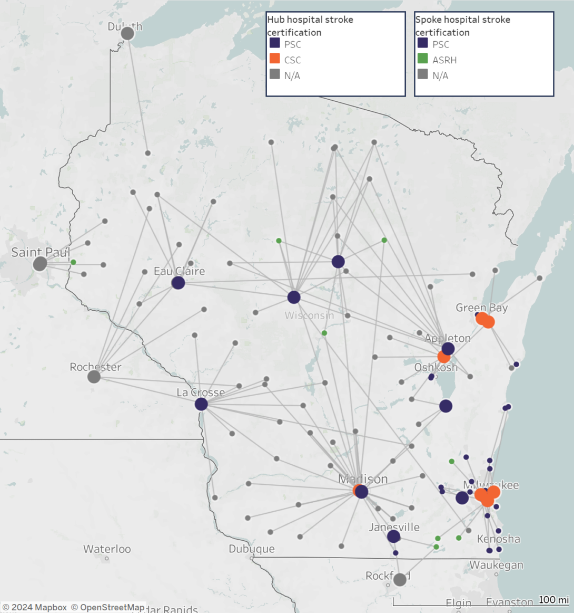
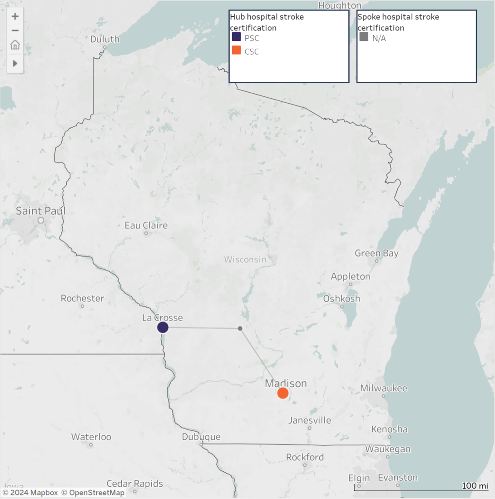

::: {style="float: left; width: 50%; margin-right: 15px;"}

:::

Every **40 seconds**, someone in the United States has a stroke, and to avert the worst health outcomes, minutes count. Timely access to critical stroke care depends not only on how long it takes a patient to get to a hospital, but also on how long it takes to transfer them from a local hospital (spoke) to a hospital with the resources to treat and manage more complex cases (hub). In Wisconsin, newly created maps clearly show those spoke-to-hub distances and make it easy to see the geographic disparities in access to stroke care across the state.

Since 2012, the Wisconsin Department of Health Services (WDHS) has been funded by CDC’s Paul Coverdell National Acute Stroke Prevention Program to improve stroke systems of care – from EMS response, to inpatient care, to post-discharge care and rehabilitation. Using the [Get with the Guidelines stroke registry](https://www.heart.org/en/professional/quality-improvement/get-with-the-guidelines/get-with-the-guidelines-stroke/get-with-the-guidelines-stroke-registry-tool), WDHS found that in 2020, nearly one quarter of the state’s stroke patients were transferred from spoke to hub hospitals. In early 2021, WDHS leveraged partnerships with eight stroke coordinators across five public health regions to identify hospitals where these transfers are taking place and learn more about barriers to ensuring that, when needed, stroke patients in all parts of the state receive advanced care without delay.

### Seeing the Differences

To better understand some of the challenges to timely care, WDHS needed to be able to clearly visualize the distances between community hospitals–where stroke patients initially arrive–and hospitals with the capacity to provide advanced stroke care. Using GIS, WDHS created [*Stroke Transfer Maps*](https://www.dhs.wisconsin.gov/coverdell/stroke-transfer-map.htm), which show the location of acute stroke-ready hospitals, comprehensive stroke centers, and primary stroke centers, as well as the transfer lines, estimated driving distances, and transport times to these hubs from local hospitals.

### Addressing the Geographic Disparities

::: {style="float: right; width: 50%; margin-left: 15px;"}

:::

For WDHS, the Stroke Transfer Maps make it possible to visualize gaps in stroke systems of care. With this broad perspective, regional stroke coordinators are able to focus policymakers’ attention on strategies for closing those gaps, including:

- Customizing regional stroke systems of care to address differences in hospital certifications, geography, and resources.
- Monitoring what hospitals’ catchment areas are and how hospital closures result in those areas growing over time, threatening service capacity.
- Establishing policies related to telemedicine that consider the state’s population and geography to help address unequal coverage of services, resources, and facilities in rural areas.
- Establishing a stroke systems of care task force that develops policies and procedures, such as transport bypass protocols, that help community and emergency services personnel best route their stroke patients to appropriate centers of care.

WDHS added the maps to their [website](https://www.dhs.wisconsin.gov/coverdell/stroke-transfer-map.htm), with options to view maps for the entire state and by hospital, and shared their work through the Chronic Disease GIS Network, providing an example for staff in other health departments who are interested in using this innovative mapping approach to address gaps in access to stroke care in their communities.

### Looking Ahead
Wisconsin is now working on a telestroke map, which overlays health care provider consultations among hospitals on the stroke transfer maps. Because some stroke transfers occur by air, WDHS also plans to incorporate aerial stroke transfers into future maps.

For more details, read the [article](https://www.cdc.gov/pcd/issues/2024/23_0166.htm) published in Preventing Chronic Disease.
