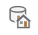
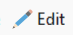
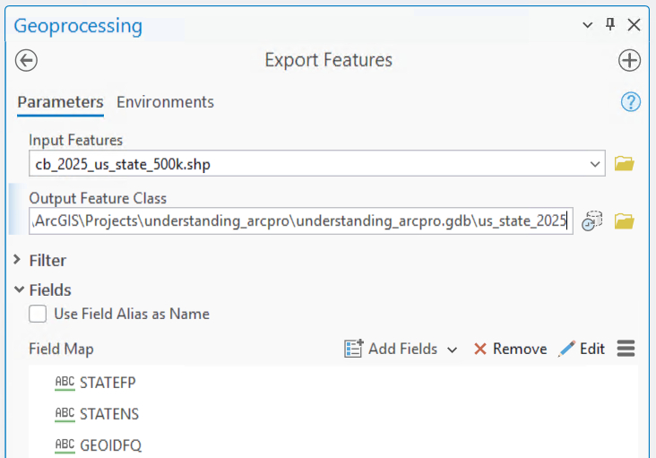
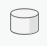
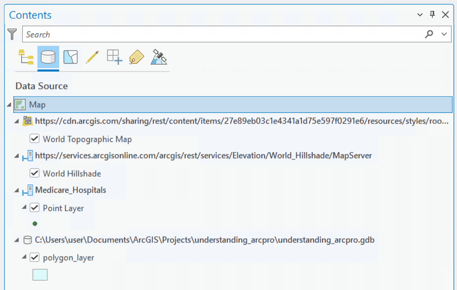
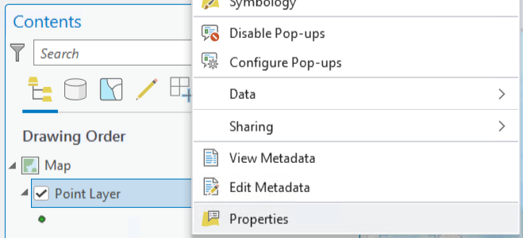
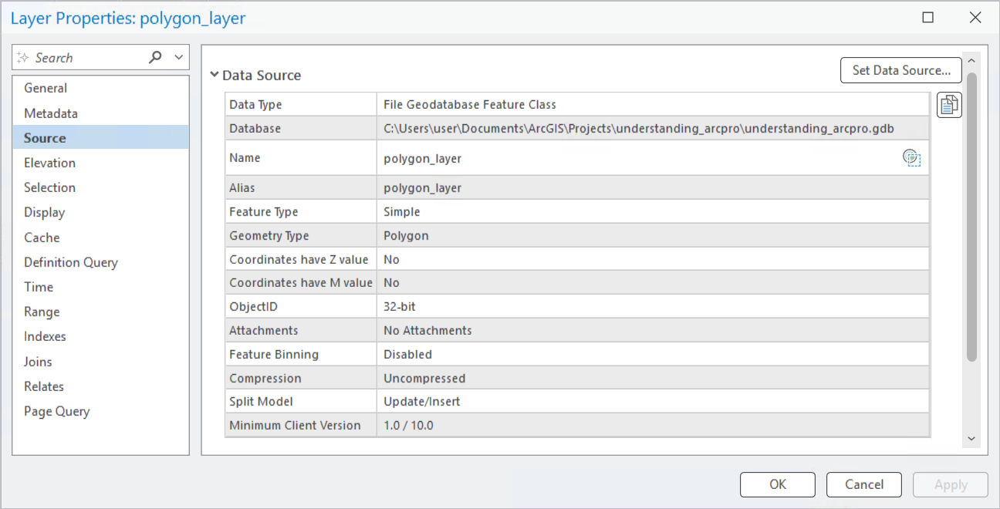

ArcGIS Pro is a referential software. This means that rather than storing data within a project itself, ArcGIS Pro stores a reference to where data is stored. This means data CAN be in a project, but it also can be stored else where on your computer, on a remote server, or even on the internet. This also means that renaming, moving, or deleting data from where it is stored, can result in loss of data in your project. Additionally, any changes made to the data itself outside the project will affect the project as well.

## Methods to Add Data

### Add Data

The most obvious way to add data to ArcGIS Pro is by using the **Add Data** {height="1em"} button. When doing so, ArcGIS Pro will create a connection between the original data source and the project. While this is easy, there are some drawbacks:

- Changes in the file made outside of ArcGIS Pro will also be reflected within ArcGIS Pro.
- A change in the file's name or location will cause the data connection to be broken.
- Data must be in a geodatabase or shapefile to add, delete, or modify its rows, columns, and values. If it is stored within a geodatabase or shapefile, any changes you make will also reflect within the original data.
- When using Add Data, ArcGIS Pro automatically assigns column data types for files like CSVs or Excel workbooks, without allowing you to manually define them during import. 

Thus, adding data this way should be used when data is too large to store in multiple projects, or you may require changes made to this data to be reflected within the project. However, you must ensure that the path to the data must stay consistent. Any changes to the location or name of the data will cause errors in the projects that reference them.  

### Export Into Project Geodatabase

Every ArcGIS Pro project includes a default file geodatabase that serves as the automatic workspace for geoprocessing outputs. You can also leverage this geodatabase as a centralized repository for your project's source data. To consolidate your datasets inside the geodatabase, use the Export toolset (such as **Export Features**, **Export Table**, or **Export Raster**).

Storing datasets in the project geodatabase centralizes your data into a single portable location. This organized structure ensures robust path integrity by keeping data paths relative. When you move or share the project folder, the references remain intact, eliminating broken data connections worries.

#### Using an Export Tool

To add data to a project geodatabase using an Export tool, navigate to the **Analysis** tab and open up the **Tools** {height="1em"}. Search for the relevant Export tool (**Export Table** for tabular data, **Export Features** for vector data, or **Export Raster** for raster data). Click the folder icon {height="1em"} next to the **Input** and navigate to where your data is stored. Next, click on the folder icon {height="1em"} next to the **Output**, navigate into your project's geodatabase {height="1em"}, and name your dataset.

Certain file types like CSVs or Excel workbooks do not store data types, so while Export tools will make informed guesses at these data types, you can also adjust them manually to your needs within the **Fields** dropdown under **Edit** {height="1em"}.

{width="80%" fig-align="center"}

## Methods to View Data Source

After having added data to a map, ArcGIS Pro provides two primary methods to check the data paths.

### Contents Pane

Within the Catalog Pane, click on the List By Data Source icon {height="1em"} to reveal the paths of your active map's data.

{width="80%" fig-align="center"}

### Data Properties

To check the source path of a specific dataset, right click on dataset within the Catalog Pane and open up its Properties. Click on the Source tab to reveal its data source.

::: {layout="[52.5, 47.5]" layout-valign="top"}

:::

---

For more information, check out these resources:

- [Spatial Data - Topics in GIS](../../topics/spatial_data.qmd)
