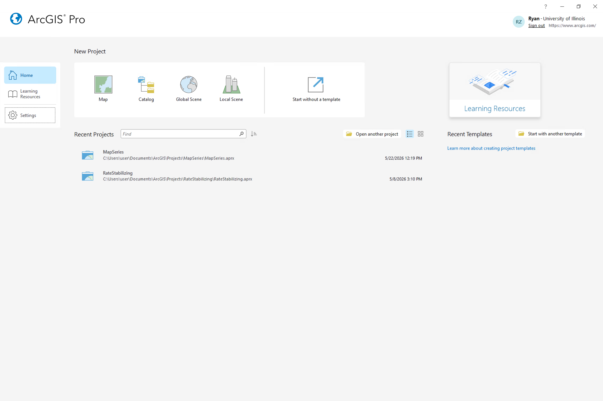
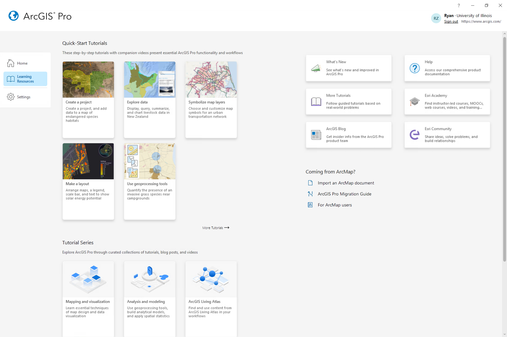
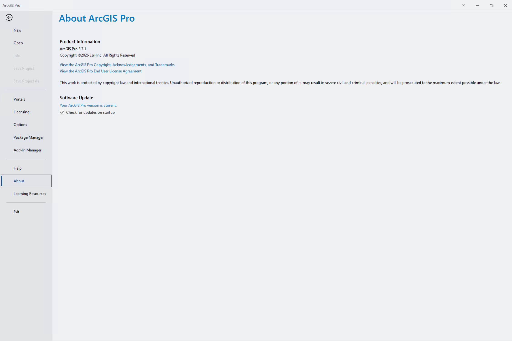
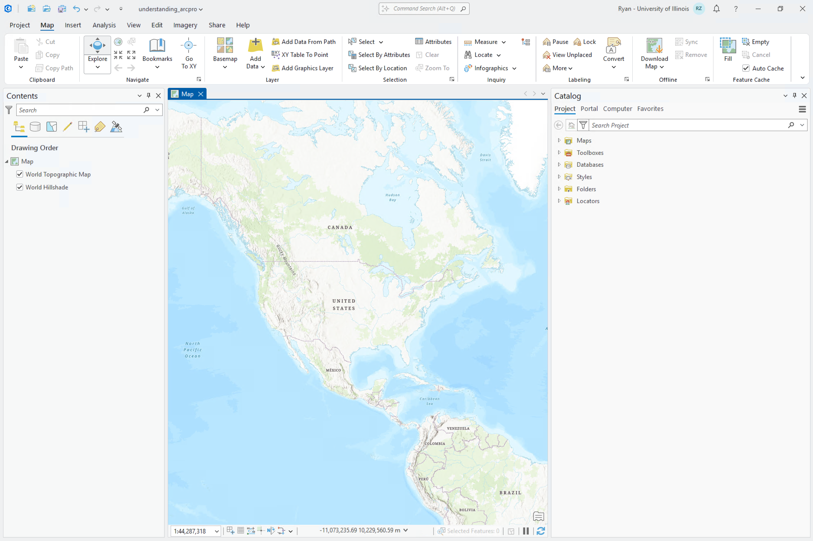
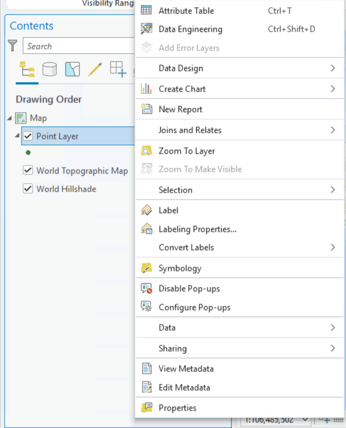
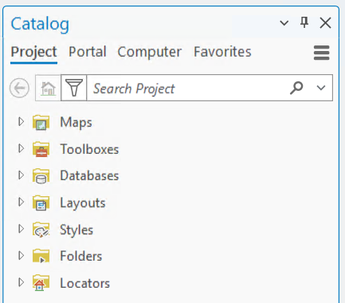

## Start Page

ArcGIS Pro will, by default, open up to the Start Page. This start page has three tabs: Home, Learning Resources, and Settings.

### Home

{width="80%" fig-align="center"}

The **Home** tab features 4 default templates. Each of which is designed toward a specific aim.

- **Map** - 2D cartography
- **Catalog** - Data management
- **Global Scene** - 3D cartography with planetary curvature
- **Local Scene** - 3D cartography with a flat coordinate plane

When doing quick GIS work that doesn't need to be saved, you can also **Start without a template**.

### Learning Resources

{width="80%" fig-align="center"}

The **Learning Resources** tab features helpful tutorials, news items, and recent blog postings. If you are looking for additional materials to build your skills, take a look here.

### Settings

{width="80%" fig-align="center"}

The **Settings** tab contains the system-level settings for managing application behavior, licensing, and user account configurations.

Some of the most important pages include:

- **Portals** - switch between different user accounts to access specific extensions, tools, or ArcGIS Online content.
- [**Licensing**](https://doc.esri.com/en/arcgis-pro/latest/get-started/about-licensing.html) - check active account extension permissions and manage active data licenses.
- [**Options**](https://doc.esri.com/en/arcgis-pro/latest/get-started/options.html) - configure Project Options (apply to current project) or Application Options (apply to all future proects).
- **Package Manager** - manage external Python scripting environments and custom tool libraries.
- [**Add-in Manager**](https://doc.esri.com/en/arcgis-pro/latest/get-started/manage-add-ins.html) - install, update, or remove third-party application extensions and custom ribbon tools.
- **Help** - open official software documentation, tutorials, and community support resources.
- **About** - view software version details and check for available application updates.

## Project Layout

{width="80%" fig-align="center"}

The project ArcGIS Pro layout should feel familiar to users of Microsoft Office software. It features a horizontal **ribbon** that groups features into different tabs. Tabs may change in this ribbon based on what is selected below. Within these tabs exist groups which can be expanded {height="1em"} to reveal additional options.

Below the ribbon, there are views and panes. **Views** are windows for working with data. You can have multiple open at once, but only one may be active at a time. (The active view will change the ribbon tabs available). 

**Panes** are side panels that often provide functionality not available in the ribbon. The two most common panes are the Contents and Catalog panes (can be opened from the main ribbon View -> Contents or Catalog Pane).

### Contents Pane

::: {layout-ncol=2}
The **Contents Pane** shows the contents of the active view. ArcGIS Pro is similar to software like Adobe Photoshop or Illustrator in that contents are organized into layers. So, in the context of an active Map, the Contents Pane will show you the layers present in a map and draw them in order with higher items being on top. Additional functionality regarding individual layers can also be found by right clicking a layer within the Contents Pane.

:::

### Catalog Pane

::: {layout-ncol=2}

::: {#second-column}
The **Catalog Pane** lists the contents of your entire project. A typical Map project will contain folders for:

- **Maps** - Maps within your project (If you close a map you can find it here).
- **Toolboxes** - additional tools that you may add
- **Databases** - databases which contain relevant data for your project
- **Layouts** (shown once you add a Layout) - virtual pages to organize and arrange map elements to design a final product
- **Styles** - symbols, colors, and label formats to create custom map visuals
- **Folders** - connections to folders on your system
- **Locators** - address matching tools
:::
:::

---

For more information, check out these resources:

- [Getting Started - ArcGIS Pro Docs](https://doc.esri.com/en/arcgis-pro/latest/get-started/get-started.html)
