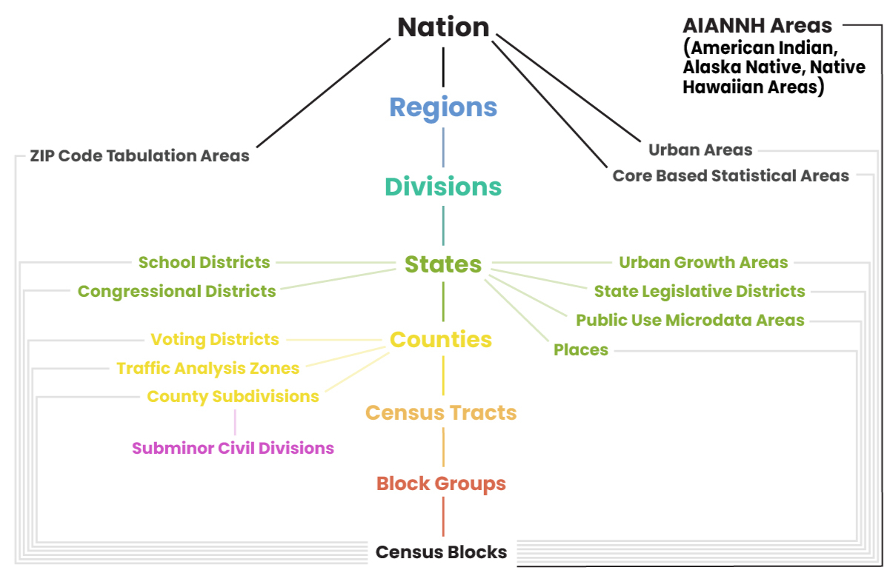

The US Census Bureau administers the **decennial census** every decade to capture essential demographic data for the entire population. To supplement this headcount, the Bureau also conducts the **American Community Survey (ACS)**, which collects data monthly from a small percentage of residents and releases the aggregated findings every year. This comprehensive socio-economic data covers topics such as income, education, employment, and housing quality to offer communities current in-depth data between the 10-year counts.

### Standard Geographic Areas

To organize and report this data, both the decennial census and the ACS rely on a nested framework of geographic areas. This hierarchy begins with **states**, which are divided into **counties**, which are then split into **census tracts** designed to contain roughly 4,000 residents. Tracts are further broken down into **block groups**, and the smallest units of all are **census blocks**. The official boundaries for these areas are established each decade, but they are not completely frozen. Minor updates are applied each year to reflect local annexations and legal boundary changes.

Every one of these geographic units is uniquely identified using a standardized system of numeric **Federal Information Processing Series (FIPS)** codes. These individual codes combine from largest to smallest into a single, comprehensive string called a **Geographic Identifier (GEOID)**. A full 15-digit GEOID consists of a two-digit state code, a three-digit county code, a six-digit tract code, a one-digit block group code, and a three-digit block code. This means a state can be uniquely identified by a two-digit code, a county by a five-digit code, a tract by an 11-digit code, and so on.

```{ojs}
//| echo: false

nestedData = FileAttachment("data/census_nested.geojson").json()

mapRelationships = {
  if (!nestedData || !nestedData.features) return [];

  const features = nestedData.features;

  const nation = features.find(f => f.properties.GEOID === "US");
  const state = features.find(f => f.properties.GEOID === "17");
  const county = features.find(f => f.properties.GEOID === "17031");
  const tract = features.find(f => f.properties.GEOID === "17031839100");
  const blockGroup = features.find(f => f.properties.GEOID === "170318391002");
  const block = features.find(f => f.properties.GEOID === "170318391002008");

  return [
    { title: "State FIPS: 17",                 base: nation,     highlight: state },
    { title: "County FIPS: 17 + 031",         base: state,      highlight: county },
    { title: "Tract FIPS: 17031 + 839100",    base: county,     highlight: tract },
    { title: "Block Group FIPS: 17031839100 + 2", base: tract,   highlight: blockGroup },
    { title: "Block FIPS: 170318391002 + 008", base: blockGroup, highlight: block }
  ].filter(d => d.base && d.highlight);
}

themeSyncedSvgMap = {
  const mapWidth = 160;
  const mapHeight = 160;
  const gap = 12; 
  const padding = 10;
  const labelHeight = 25; 

  const totalWidth = (mapWidth * 5) + (gap * 4);
  const totalHeight = mapHeight + labelHeight;

  const pageTextColor = "var(--quarto-body-color, #212529)";

  const svg = d3.create("svg")
    .attr("viewBox", `0 0 ${totalWidth} ${totalHeight}`)
    .attr("width", "100%")
    .attr("height", "auto")
    .style("background", "transparent")
    .style("font-family", "sans-serif");

  // Fixed recursion logic to properly extract longitude and latitude coordinates
  function getExtremaPoints(feature, projection) {
    let allPoints = [];
    
    function extract(coords) {
      if (Array.isArray(coords) && typeof coords[0] === 'number' && typeof coords[1] === 'number') {
        allPoints.push(coords);
      } else if (Array.isArray(coords)) {
        coords.forEach(extract);
      }
    }
    extract(feature.geometry.coordinates);

    let highest = null;
    let lowest = null;

    allPoints.forEach(coord => {
      const pt = projection(coord);
      if (!pt || isNaN(pt[0]) || isNaN(pt[1])) return;

      // Top-most (lowest Y pixel value), then Left-most (lowest X pixel value)
      if (!highest || pt[1] < highest[1] || (pt[1] === highest[1] && pt[0] < highest[0])) {
        highest = pt;
      }
      // Bottom-most (highest Y pixel value), then Right-most (highest X pixel value)
      if (!lowest || pt[1] > lowest[1] || (pt[1] === lowest[1] && pt[0] > lowest[0])) {
        lowest = pt;
      }
    });

    return { highest, lowest };
  }

  const boundsCache = [];

  mapRelationships.forEach((map, index) => {
    const xOffset = index * (mapWidth + gap);

    const cellG = svg.append("g")
      .attr("transform", `translate(${xOffset}, 0)`);

    cellG.append("text")
      .attr("x", mapWidth / 2)
      .attr("y", 14)
      .attr("text-anchor", "middle")
      .style("font-size", "9.5px")
      .style("font-weight", "bold")
      .style("fill", pageTextColor)
      .text(map.title);

    let projection;
    const innerExtent = [[padding, padding + labelHeight], [mapWidth - padding, mapHeight - padding]];
    
    if (index === 0) {
      projection = d3.geoAlbersUsa().fitExtent(innerExtent, map.base);
    } else {
      projection = d3.geoMercator().fitExtent(innerExtent, map.base);
    }

    const pathGenerator = d3.geoPath().projection(projection);

    const highExtrema = getExtremaPoints(map.highlight, projection);
    const baseExtrema = getExtremaPoints(map.base, projection);

    // Fixed absolute pixel positioning using xOffset additions
    boundsCache.push({
      highlight: {
        top: highExtrema.highest ? [highExtrema.highest[0] + xOffset, highExtrema.highest[1]] : null,
        bottom: highExtrema.lowest ? [highExtrema.lowest[0] + xOffset, highExtrema.lowest[1]] : null
      },
      base: {
        top: baseExtrema.highest ? [baseExtrema.highest[0] + xOffset, baseExtrema.highest[1]] : null,
        bottom: baseExtrema.lowest ? [baseExtrema.lowest[0] + xOffset, baseExtrema.lowest[1]] : null
      }
    });

    cellG.append("path")
      .datum(map.base)
      .attr("d", pathGenerator)
      .attr("fill", "var(--quarto-border-color, #eceff1)")
      .attr("stroke", "var(--quarto-text-muted, #b0bec5)")
      .attr("stroke-width", 0.75)
      .attr("fill-opacity", 0.4);

    cellG.append("path")
      .datum(map.highlight)
      .attr("d", pathGenerator)
      .attr("fill", pageTextColor)
      .attr("stroke", pageTextColor)
      .attr("stroke-width", 1)
      .attr("fill-opacity", 0.65);
  });

  // Fixed link attributes pointing explicitly to array indices [0] and [1]
  for (let i = 0; i < boundsCache.length - 1; i++) {
    const currentMap = boundsCache[i];
    const nextMap = boundsCache[i + 1];

    if (currentMap.highlight.top && nextMap.base.top) {
      svg.append("line")
        .attr("x1", currentMap.highlight.top[0])
        .attr("y1", currentMap.highlight.top[1])
        .attr("x2", nextMap.base.top[0])
        .attr("y2", nextMap.base.top[1])
        .attr("stroke", pageTextColor)
        .attr("stroke-width", 0.75)
        .attr("stroke-dasharray", "2,2")
        .attr("opacity", 0.5);
    }

    if (currentMap.highlight.bottom && nextMap.base.bottom) {
      svg.append("line")
        .attr("x1", currentMap.highlight.bottom[0])
        .attr("y1", currentMap.highlight.bottom[1])
        .attr("x2", nextMap.base.bottom[0])
        .attr("y2", nextMap.base.bottom[1])
        .attr("stroke", pageTextColor)
        .attr("stroke-width", 0.75)
        .attr("stroke-dasharray", "2,2")
        .attr("opacity", 0.5);
    }
  }

  return svg.node();
}
```

Beyond this standard nested hierarchy, the Census Bureau also tabulates data for alternative, non-nested geographic units to meet specific statistical and administrative needs. A prominent example is the **ZIP Code Tabulation Area (ZCTA)**, which are generalized areal representations of United States Postal Service ZIP Code service routes. Because traditional ZIP codes are linear delivery routes that often cross state and county lines rather than distinct geometric shapes, the Bureau creates ZCTAs by aggregating census blocks to closely approximate those postal boundaries for statistical reporting. Other specialized geographies include **Public Use Microdata Areas (PUMAs)**, **Census Designated Places (CDPs)**, **school districts**, **voting districts**, and **metropolitan statistical areas**.

```{=html}
<style>
.figure {
  margin: auto;
  text-align: center;
}
</style>
```

{width="80%" fig-align="center"}

### Boundary types

The Census Bureau provides two primary types of boundary files: TIGER/Line and Cartographic. While both boundaries represent the exact same areas, they serve different purposes. **TIGER/Line boundaries** represent the official legal boundaries, which can and often do extend into open water. As such, they often make coastal states look blocky as boundaries extend miles into the ocean. 

**Cartographic boundaries** are modified specifically for thematic mapping by clipping out large water bodies to mirror the actual landmass. These boundaries cut off exactly at the shoreline, creating the recognizable, clean coastline silhouette people expect on a map. Cartographic files also undergo generalization to remove redundant vertices, resulting in smaller files that render much faster. The Census Bureau offers these simplified boundaries at scales of 1:500,000 for regional detail, 1:5,000,000 for multi-state views, and 1:20,000,000 for national visualizations, which reduces the computational burden caused by complex TIGER/Line datasets.

```{ojs}
//| echo: false

geojson = FileAttachment("data/tiger_v_carto.geojson").json()

themeColor = {
  const p = document.querySelector("p") || document.body;
  return getComputedStyle(p).color;
}

boundaryConfig = [
  { id: "tiger", label: "TIGER/Line" },
  { id: "cb_500k", label: "Cartographic 500k" },
  { id: "cb_5m", label: "Cartographic 5m" },
  { id: "cb_20m", label: "Cartographic 20m" }
]

html`<div style="display: flex; flex-direction: row; width: 100%; gap: 15px; justify-content: space-between;">
  ${boundaryConfig.map(config => {
    const features = geojson.features.filter(d => d.properties.boundary === config.id);
    const geojsonSubset = { type: "FeatureCollection", features: features };

    const width = 250;
    const height = 180; 

    const projection = d3.geoMercator().fitExtent([[15, 35], [width - 15, height - 15]], geojsonSubset);
    const pathGenerator = d3.geoPath().projection(projection);

    const svg = d3.create("svg")
        .attr("viewBox", `0 0 ${width} ${height}`)
        .style("width", "24%") 
        .style("height", "auto")
        .style("background", "none");

    svg.append("text")
        .attr("x", width / 2)
        .attr("y", 20)
        .attr("text-anchor", "middle")
        .style("font-family", "sans-serif")
        .style("font-size", "17px")
        .style("font-weight", "bold")
        .style("fill", "currentColor") 
        .text(config.label);

    svg.append("g")
      .selectAll("path")
      .data(features)
      .join("path")
        .attr("d", pathGenerator)
        .attr("fill", "var(--quarto-border-color, #eceff1)")
        .attr("stroke", "var(--quarto-body-color, #212529)")
        .attr("stroke-width", 0.75)
        .attr("fill-opacity", 0.4);

    return svg.node();
  })}
</div>`
```

All boundary files can be downloaded from the Census [here](https://www.census.gov/geographies/mapping-files.html). 

---

For more information, check out these resources:

- [TIGER Data Products Guide](https://www.census.gov/programs-surveys/geography/guidance/tiger-data-products-guide.html)

